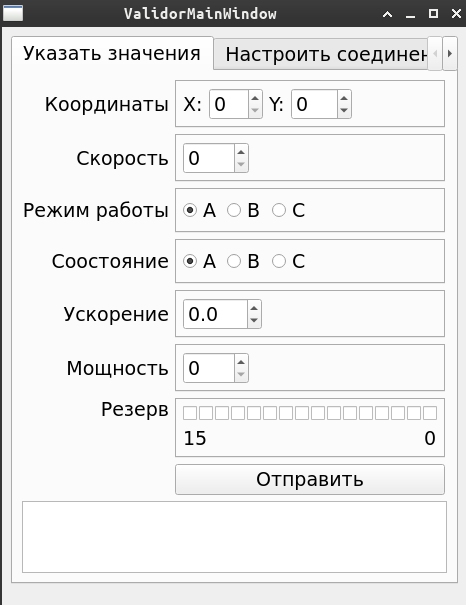

### Build

Для сборки вам необходимы будут библиотека `qt5.15` а также `boost`.

Используйте `cmake`

```bash 
cmake -B build
make
```

### Run

Запустите сервер, который будет прослушивать порт, указываемый в качестве параметра `-p`, на `loclahost`.

```bash
build/server/server -p 8000
```

Запустите клиентское приложение

```bash
build/server/client
```



И отслеживайте сообщения запущенного сервера в консоли. 
